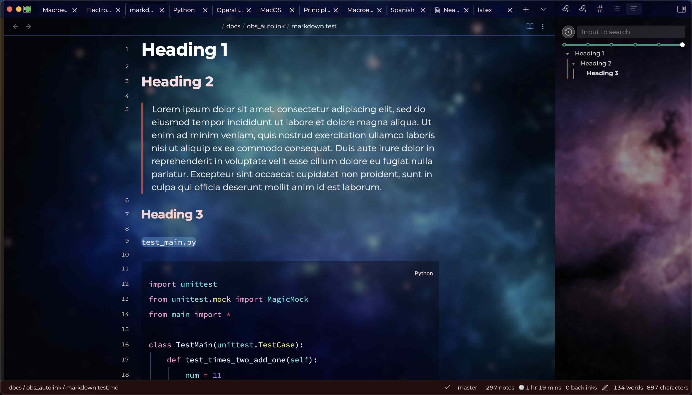
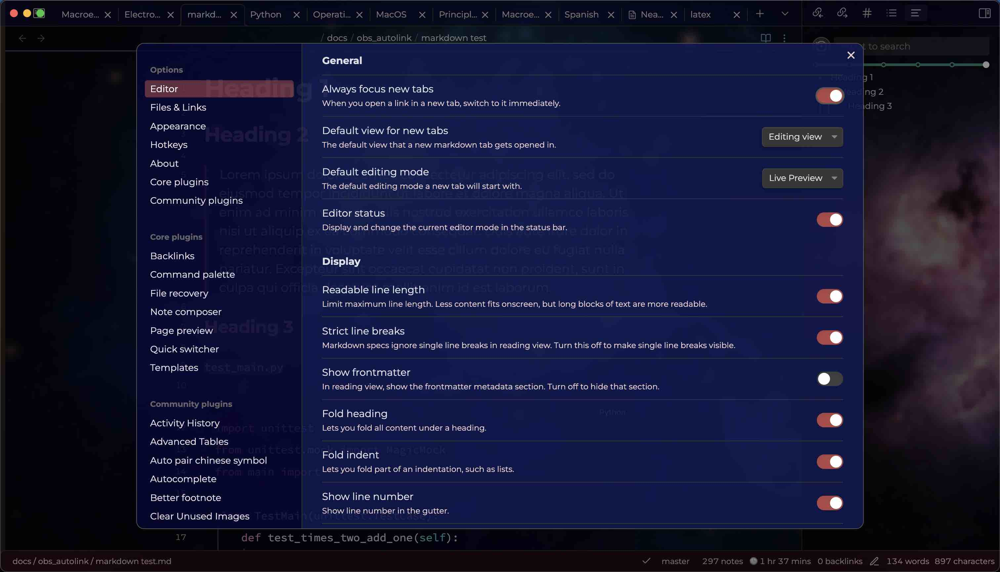
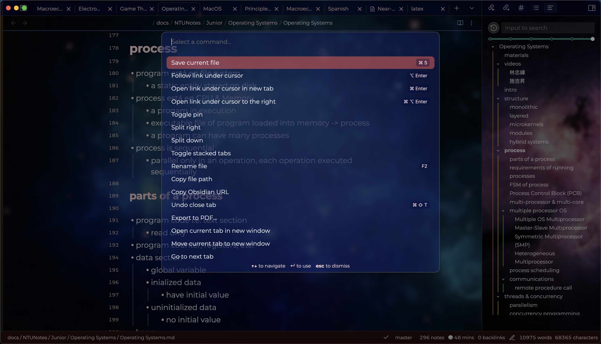

# Nebula Theme for Obsidian

A modern, clean theme for Obsidian with a beautiful nebula-inspired aesthetic. This fork includes performance improvements and modern CSS practices while maintaining the original design philosophy.

## Features

- Minimalist sidebar design that prioritizes keyboard shortcuts and command palette usage
- System font stack for improved performance
- Beautiful nebula-inspired backgrounds for sidebars and main pane
- Clean, modern typography and spacing

## Usage Notes

The theme intentionally minimizes the leftmost vertical bar (containing multiple tools) as it emphasizes keyboard shortcuts and command palette usage. If you prefer a more prominent sidebar, you can:
- Override styles using CSS snippets (modify classes with `side-dock-ribbon` prefix)
- Choose an alternative theme that better suits your workflow

## Screenshots

## Credits

- Original theme by [dlccyes](https://github.com/dlccyes)
- Performance improvements and modernization by [OneNiNE87](https://github.com/OneNiNE87) and GitHub Copilot
- Based on pull request contributions to the original [Obsidian Nebula Theme](https://github.com/dlccyes/obsidian-nebula)

## Changes from Original

- Removed Google Fonts dependency in favor of system fonts
- Improved CSS selector formatting for better maintainability
- Added nebula-themed backgrounds for enhanced visual appeal
- Modernized CSS practices while preserving the original design

## License

MIT License - See LICENSE file for details
